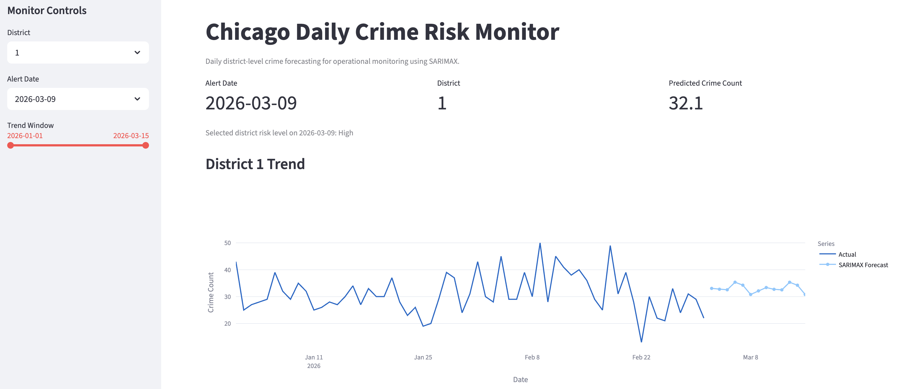

# Chicago Crime Risk Monitor

## Project Overview
Chicago Crime Risk Monitor is an interactive Streamlit dashboard designed to visualize district-level crime patterns and support risk monitoring with forecast-informed insights. The application helps users explore recent crime activity, compare district trends, and review analytical outputs in an accessible interface.

## Motivation
Crime patterns vary substantially across Chicago districts, and static reports are often not enough for exploratory analysis or operational monitoring. This project translates district-level crime analysis into an interactive dashboard so users can quickly inspect spatial and temporal patterns through a more intuitive interface.

## Key Features
- Interactive district-level crime monitoring
- Trend visualization for selected districts
- Comparative views across locations or crime patterns
- Forecast-informed risk insights
- Streamlit-based local dashboard demo

## Data
The dashboard is built on district-level Chicago crime data prepared for academic project use. This repository includes the files required to run the app locally, while additional raw or intermediate project materials may be excluded for portfolio clarity.

## Analytical Foundation
The dashboard is based on a broader crime forecasting project involving:
- district-level crime aggregation
- exploratory time-series analysis
- district grouping and comparison
- model-based forecasting and evaluation
- translation of analytical results into an interactive monitoring interface

## Selected Screenshots

### Dashboard Overview


### District-Level View


### Model and Risk Insights


## My Contribution
- Helped translate crime analysis outputs into a Streamlit-based dashboard
- Organized project files for demo and portfolio presentation
- Contributed to presentation of district-level risk insights and user-facing analytical workflow

## Repository Structure
- `app.py`: main Streamlit application
- `data/`: app input data and related notes
- `assets/`: dashboard screenshots used in the README
- `requirements.txt`: Python dependencies
- `start_app.command`: local launcher for the dashboard

## How to Run
1. Clone the repository
2. Install dependencies:
   ```bash
   pip install -r requirements.txt